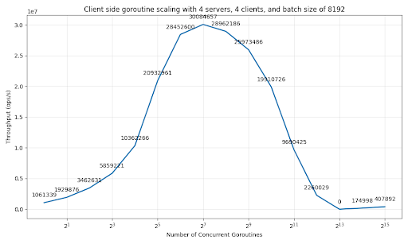

# Distributed Key-Value Store

<!---------------------------------------------------------------------------->
## Results

### Throughput
After combining our changes and running on an 8 node cluster with ideal parameters, our group reached a **peak total throughput of 31,323,264 op/s**.

### Hardware and Network Utilization
Below is the CPU and memory utilization for node0 during a throughput test of our final implementation. **CPU usage is ~80%, while memory usage is 1.79GB**

We also tracked network usage for the same test - totalling **6.7Gbs**

sent: 745,004.946 KB/sec ≈ 728 MB/sec\
received: 111,754.621 KB/sec ≈ 109 MB/sec\
837 MB/sec ≈ 6.7 Gbps\
6.7 Gbps / 10 Gbps = 67%

### Scaling

We tested throughput for varying numbers of client and server nodes. We found that our solution has significant throughput gains as more nodes are utilized. From our testing, the most optimal client to server distribution is one client node per server node. Below are the results for running our solution for one, two, and four each of client and server nodes.

| # Clients | # Servers | Throughput [ops/s]|
|-----------|-----------|-------------------|
| 1         | 1         | 3,185,204         |
| 2         | 2         | 11,426,632        |
| 4         | 4         | 31,323,264        |

Scaling our implementation by **doubling client and server nodes** gave us a throughput increase of roughly **three times.**

We also tested the scaling of various parameters of our implementation to find the optimal values - details are found in the performance graphs of the design section.

<!---------------------------------------------------------------------------->
## Design

The first step our group took was to measure the baseline throughput for the unchanged skeleton code to use as a reference for comparison. We found the original throughput to be around 10,000 operations per second for two clients and one server.

### Important Changes
> We made 4 important modifications to the design to improve throughput:
> - **Read-Write Mutexes with sync.Map**
> - **Sharding**
> - **Additional Client Concurrency**
> - **Batching Client Requests**

### Read-Write Mutexes
The skeleton code used a single mutex to lock the key-value map for any read or write to the KVS server. However, this effectively makes all operations occur sequentially, causing massive performance losses. A simple yet effective change we made was to use the `sync.Map` data structure, which provides per-key RWMutexes to the KVS. This allows for multiple threads batch requests to read the same key at a time and to write to multiple different keys at a time in the KVS while maintaining linearizability.

Specifically, we replaced sync.Mutex + map[string]string with sync.Map and atomic operations for statistics tracking.

#### Sharding
As we are implementing a distributed key-value store, we want to take advantage of multiple server nodes to handle client requests. However, it is important to ensure we maintain the illusion that our clients are interacting with a single server machine. For example, if Client A sends a put operation, another Client B should be able to retrieve the correct value for the same key regardless of which server received Client A’s request. In order to achieve this, we implemented sharding based on keys on the client side. We do this by generating a 32 bit hash using an operation’s key, then use modulus by the number of available servers to assign a server for that key. This ensures that operations with identical keys will be distributed to the same server. With this method of sharding implemented, we are free to distribute requests to multiple servers to improve throughput.

While sharding and distributing requests to multiple server nodes produced no throughput improvements on its own, it produced drastic improvements when combined with our other changes. These improvements can be seen in all of our throughput plots for said changes in later sections. In each of these plots, we run each test with different distributions of client to server nodes.

One alternative approach considered was to replicate data across server nodes and distribute requests evenly to spread the network load across servers. This would help ensure linearizability while avoiding overloading a single node with requests. The tradeoff though is this would require a much more complex implementation including replication and consensus and would not be as lightweight. Given time constraints, this approach was not implemented and could not be sufficiently compared to the sharing methodology.

#### Additional Client Concurrency

Our next design decision was to introduce numerous goroutines on the client side to add concurrency to the `runClient` function. By introducing concurrency to our clients, we massively improve throughput by overlapping multiple requests simultaneously, thereby utilizing the CPU far more efficiently. We devised a script to test throughput with various goroutine counts to narrow down the most optimal number, and reran those tests with differing client to server distributions. These results are below:

with throughput on the vertical axis.

We determined the maximum concurrent number of Goroutines by doing a throughput analysis on 4 servers and 4 clients. **We found that 128 goroutines** is the optimal count for an **8 node cluster with batch size of 8,192**; beyond that throughput appears to have diminishing returns. Additionally, a 4 client, 4 server distribution far outclassed other distributions for this change, reaching a total throughput of around 570,000 with just these two changes.

#### Batching Client Requests

Our next step was to implement batch requests on the client side. Since serializing and deserializing requests can be expensive, we wanted to maximize the number of operations per RPC call to reduce the total number of network operations. In order to determine the optimal number of operations per batch, we plotted the throughput for various batch sizes at 128 goroutines. The results are below:

We obtained a massive throughput increase through this change. **With a batch size of 8,192 we reached about 30 million throughput on a 4 client, 4 server distribution.**

### Changes Unused in Final Implementation

We also tried implementing various caching strategies, including server-side and client-side caching.

#### Server-side caching
We once tried implementing server-side caching but ultimately abandoned this approach. When using multiple goroutines (numClient = 256) without batch processing on a 4-node cluster, we achieved around 400k ops/s, and even with a non-LRU cache maintaining an 83% hit rate, performance only improved to under 440k ops/s. We determined that the overhead from RPC calls and serialization/deserialization far outweighed the benefits of cache reads, so we decided to focus our efforts on batch processing and multiple goroutines instead.

#### Client-side caching
We also tried implementing client-side caching but could not integrate it into the other optimizations in time. The client-side cache improved the throughput of the skeleton code (1 client Goroutine, 1 server, 2 clients) client-side throughput from ~5k ops/s to ~12k ops/s, but decreased the server throughput from ~10k ops/s to ~8k ops/s.

The cache was not memory constrained and increased the setup complexity by maintaining an RPC server client-side for cache update calls initiated by the KVS server when other clients wrote to a cached key. The server maintained a mapping of keys to clients with cached copies of the key-value pair. Initial testing of the cache showed a 70% hit-rate, and 1% of cache operations to be update requests. We think that this hit-rate would increase if throughput tests were done for longer than 30s as cold misses become less frequent.

<!---------------------------------------------------------------------------->
## Reproducibility

### Hardware
Our final throughput numbers were run on a cluster of 8 m510 machines.

| Attribute           | Value                        |
|---------------------|------------------------------|
| Architecture        | x86_64                       |
| CPU                 | Intel Xeon D-1548  @ 2.00GHz |
| CPU Cores & Threads | 8 Cores 16 Threads           |
| L1 Cache            | 512KiB                       |
| L2 Cache            | 2048KiB                      |
| L3 Cache            | 12MB                         |
| System Memory       | 64GB                         |

### Throughput testing

The total throughput test for an 8 node cluster can be run with `./run-cluster.sh [server_count] [client_count] [server_args] [client_args]`. `[server_count]` and `[client_count]` specify the number of machines used for servers and clients respectively. Passing `-numClients <n>` and/or `-batchSize <N>` to `[client_args]` will set the number of client threads used on each client machine and the batch size per RPC call respectively.

Hardware and networking usage can be monitored via `htop` and `nethogs` while running a throughput test with `./run-cluser.sh`.

For our maximum throughput results and utilization metrics, we used a server:client ratio of 1:1, and specified `-numClients 128 -batchSize 8192` as `[client_args]` when running `run-cluster.sh`.

Scaling results can be reproduced by running `benchmark-batch.sh` and `benchmark-clients.sh` and visualized by the corresponding `plot_[property]_scaling.py` files.

### Dependencies

To execute `run-cluster.sh`, two main dependencies are required: `Go` and `geni-get`; `Go` for compilation of the KVS binaries, and `geni-get` for determining the node availability of the cluster.

To produce the scaling plots, `python 3` with pandas and matplotlib is required.

<!---------------------------------------------------------------------------->
## Reflections

### Learnings

*Performance Bottlenecks*
- Single-client, individual RPC calls, and coarse-grained locking severely limit throughput. The skeleton's mutex-protected map became a major contention point.

*Batching Impact*
- Reducing RPC calls from individual operations to batches of 8192 dramatically improves performance by amortizing network overhead.

*Parallelism Benefits*
- Scaling from 1 to 128 concurrent clients reveals super-linear speedup initially, then diminishing returns due to coordination overhead.

*Lock-Free Design*
- Replacing mutex-protected maps with sync.Map and atomic operations eliminates lock contention in high-concurrency scenarios.

*Sharding Effectiveness*
- Consistent hashing enables horizontal scaling by distributing load evenly across multiple servers without coordination overhead.

### Why our Optimizations Worked

*Used consistent hashing to distribute keys across servers*
- Using key hashing ensures a given server manages the read and write to specific keys (i.e. each server is responsible for a specific subset of keys across the key value store). Doing so allows us to avoid implementing replication and consensus algorithms which could create a bottleneck and use CPU and network resources that could otherwise be used for read/writes.
- It also ensures a requesting client’s request will always succeed and a client will not have to retry the request against a different node resulting in fewer potential requests overall
- The memory footprint on each server is also reduced as each server is only managing a shard of the entire data set, which could lead to an improvement in server-side cache hits

*Increased from 1 client thread per node to 128+ concurrent goroutines*
- Exploited server's concurrent processing capability (sync.Map)
- Overlapped network I/O latency with computation
- Matched concurrency to available CPU cores and network capacity

*Grouped multiple operations into single RPC calls via `BatchOp`*
- Amortized RPC cost: 1 network round-trip handles thousands of operations
- Reduced serialization overhead: One large message vs. many small ones
- Better CPU cache utilization: Processing operations in chunks
- Network efficiency: Fewer packets, better bandwidth utilization

### What did not work

*Server-side cache*
- The overhead of RPC and serializations / deserialization far outweighs the read speed improvement from a server-side cache.
- Introduced additional concurrency complexity for the server

*Client-side cache*
- The additional complexity of setting up an rpc server on each client, plus integrating the cache into our other optimizations was prohibitive in creating a performant client-side cache

#### Lessons
*Programming distributed systems is very complex*
- figuring out optimizations that maintain linearizability can be subtle
- balance between hardware and network utilization is important
- profiling for bottlenecks is key, but not always obvious what causes it

### Further Improvements
Both the client-side and server-side caches provided throughput improvements. The client-side cache more than doubled client ops/s although reducing the server ops/s, while the server-side cache provided less than a 10% improvement. Both could be considered when extreme performance is necessary.

### Contributions

| Member |                                              |
|--------|----------------------------------------------|
| Chris  | > Designed and implemented key-based sharding > Wrote script to run client thread count and batch size scaling experiments across varying client-server node ratios > Ran experiments to find optimal client thread count, batch size, and client-server ratio > Wrote python script for plotting node scaling experiments (reworked and adapted code provided by JJ initially) > Admin work - set up clusters and dev environment
| Will   | > Combined client-side batching and sharding to work together > Wrote most of design section of README
| Kyle   | > Designed and implemented client-side caching (not adopted) > Converted technical report from google doc to README and did final formatting/editing > Wrote README reproducibility hardware and testing instructions, and RWMutex design section
| JJ     | > Designed and implemented client-side multiple concurrent goroutines, batch processing, and server cache (not adopted) > Used scripts to find optimal number of concurrent goroutines and best batch size on 4-node cluster  > Monitored and recorded CPU, memory, and networking usage using `htop` and `nethogs`  > Wrote part of reflection and design sections in the README