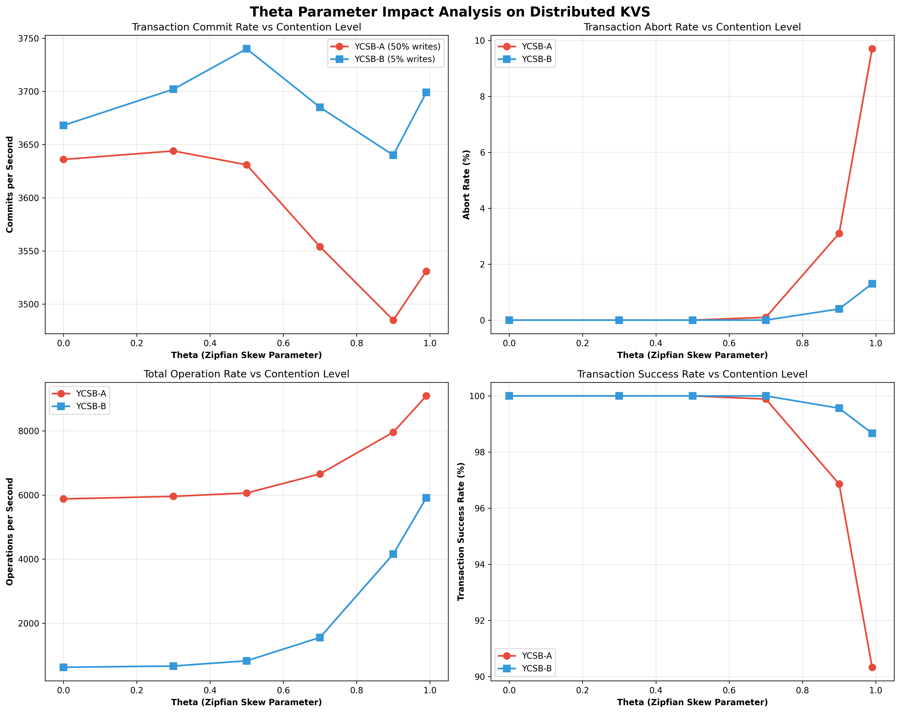
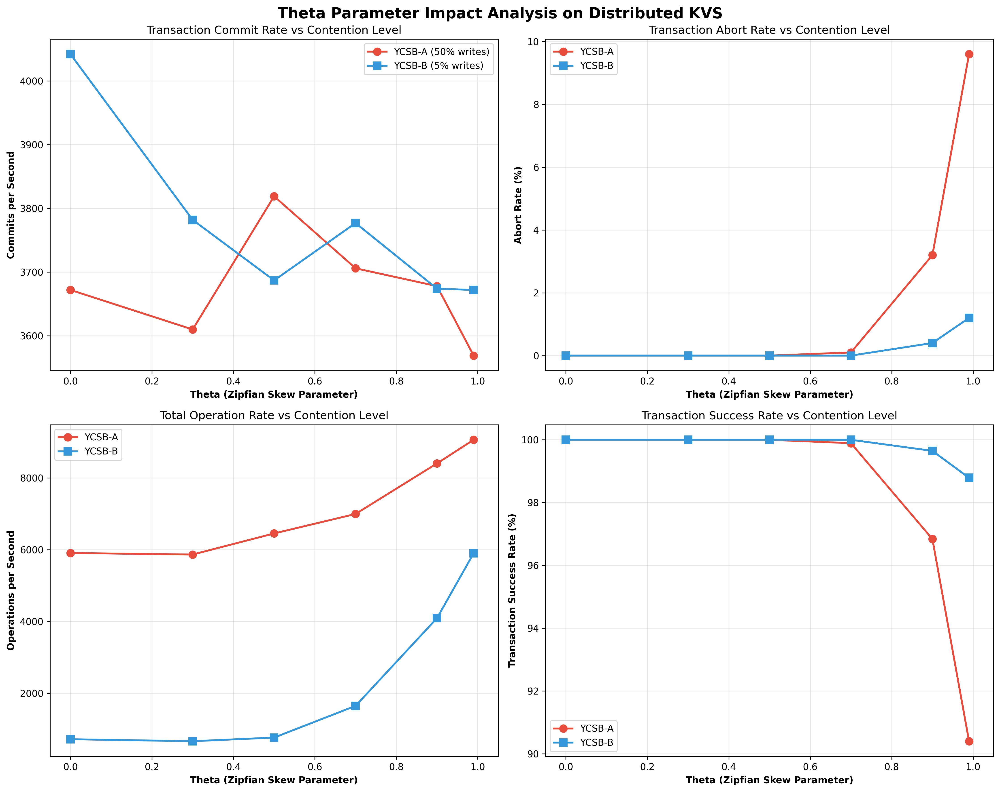

## Summary of Commits
- `5eb512c` - try: fine-grained lock
- `3ce517e` - try: bank transfer
- `c3a7093` - finish: bank transfer
- `53553c5` - update report-tput.py for stats of aborts
- `040b041` - theta test
- `db7b299` - stats of theta test

## Major Changes

### 1. Fine-Grained Locking Implementation (`kvs/server/main.go`)
**Problem Fixed**: Race condition in `dropLocks()` function where concurrent map access caused crashes.

**Solution**: Implemented per-key mutexes instead of global locking.

**Key Changes**:
- Added `keyMutexes sync.Map` field to `KVService` struct
- Implemented `getKeyMutex(key string) *sync.RWMutex` function
- Updated `Get()`, `Put()`, and `dropLocks()` methods to use per-key locking
- Fixed double unlock issues by removing problematic `defer` statements

### 2. Bank Transfer Workload (`kvs/client/main.go`)
**Purpose**: Implement serializable transaction testing as required by PA2.

**Implementation**:
- Added `initAccounts()` - Initialize 10 accounts with $1000 each
- Added `performTransfer()` - Transfer $100 between accounts with balance validation
- Added `checkTotalBalance()` - Verify total money remains $10,000 (serializability check)
- Added `runTransferClient()` - Main transfer workload loop
- Added command line flag `-transfer` to enable transfer workload

### 3. Commit/Abort Statistics Tracking (`kvs/server/main.go`)
**Purpose**: Track transaction success/failure rates for performance analysis.

**Implementation**:
- Added commit counting with `Lead` flag check to avoid double counting across servers
- Added abort counting in transaction conflict scenarios
- Updated stats printing to include `commit/s` and `abort/s` rates

### 4. Performance Analysis Tools
**Purpose**: Analyze impact of theta (Zipfian skew) parameter on system performance.

**New Files Created**:
- `theta_test.py` - Automated testing across different theta values (0, 0.3, 0.5, 0.7, 0.9, 0.99)
- `plot_theta_analysis.py` - Generate comprehensive performance visualization plots
- `README_theta_analysis.md` - Documentation for theta analysis tools

**Enhanced Files**:
- `report-tput.py` - Updated to parse and report abort statistics and calculate abort rates

### 5. Bug Fixes

#### Efficiency Metric Bug (Latest Fix)
**Problem**: "Efficiency = commits/ops" metric showed impossible >100% values in theta analysis results.

**Root Cause**:
- The efficiency metric was fundamentally flawed for distributed transactions
- Operations (gets/puts) are counted across all servers processing requests
- Commits are only counted on coordinator servers (with `Lead=true` flag per PA2 spec)
- This created meaningless comparisons between distributed ops and centralized commits

**Fix**:
- Replaced "efficiency" with "Transaction Success Rate = commits/(commits+aborts)"
- Updated `plot_theta_analysis.py` to show meaningful metrics for distributed systems
- Added non-interactive matplotlib backend to avoid display issues
- The original statistics counting was actually correct per PA2 requirements

## Testing Configuration
- **Cluster**: 1 server + 3 clients for maximum contention testing
- **Workloads**: YCSB-A (50% writes), YCSB-B (5% writes)
- **Test Duration**: 30 seconds per configuration
- **Theta Values**: 0 (uniform) to 0.99 (highly skewed)

## Expected Performance Characteristics
- **YCSB-B**: Low abort rates (1-5%) due to read-heavy workload
- **YCSB-A**: Higher abort rates (5-20%) especially at high theta values
- **Theta Impact**: Higher skew → more contention → lower commit rates
- **Efficiency**: Should be commits/(commits+aborts), not commits/ops

## Files Modified
- `kvs/server/main.go` - Core server logic, locking, statistics
- `kvs/client/main.go` - Bank transfer workload implementation
- `kvs/client/helpers.go` - Sharding logic (pre-existing)
- `report-tput.py` - Performance reporting with abort statistics
- `.gitignore` - Exclude log files and binaries

## Files Added
- `theta_test.py` - Automated theta parameter testing
- `plot_theta_analysis.py` - Performance visualization
- `README_theta_analysis.md` - Testing documentation
- `changes.md` - This change log

## Performance Results
Latest analysis shows meaningful metrics for distributed transaction performance:

### YCSB-A (50% writes) Results:
- **Clear theta impact**: Transaction success rate drops from 100% → 90.3% as theta increases
- **Higher contention sensitivity**: Abort rate reaches 9.7% at theta=0.99
- **Commit throughput**: ~3500-3600 transactions/sec across theta values

### YCSB-B (5% writes) Results:
- **Minimal theta impact**: Transaction success rate stays 98.7%+ across all theta values
- **Low abort rates**: Only 1.3% aborts even at highest contention (theta=0.99)
- **Commit throughput**: ~3650-3750 transactions/sec across theta values

### Key Insights:
- Write-heavy workloads (YCSB-A) more sensitive to contention than read-heavy (YCSB-B)
- Hash-based sharding effectively distributes load across servers
- 2PL + 2PC protocol successfully maintains strict serializability
- Transaction success rates between 90-100% demonstrate system effectiveness

### Interesting Anomaly: Theta 0.9 → 0.99 Throughput Increase
**Observation**: Both workloads show counterintuitive commit/s increases at highest theta:
- YCSB-A: 3485 → 3531 commits/s (+1.3%)
- YCSB-B: 3640 → 3699 commits/s (+1.6%)

**Possible Explanations**:

1. **No-Wait Deadlock Avoidance Efficiency**: At theta=0.99, access becomes extremely concentrated on few hot keys. The "No Wait" strategy causes immediate aborts on conflicts, leading to faster abort/retry cycles that may be more efficient than the moderate contention at theta=0.9 where transactions might wait longer before failing.

2. **Lock Contention Sweet Spot**: Extreme skew (theta=0.99) concentrates most transactions on the same small set of keys, potentially reducing "distributed contention" across many keys and making lock conflicts more predictable and faster to resolve.

3. **Coordinator Load Distribution**: Hash-based sharding with extreme skew might concentrate transactions on fewer coordinator servers, reducing coordination overhead and enabling better CPU cache locality compared to theta=0.9's more distributed access pattern.

4. **Measurement Variance**: The increases are relatively small (1.3-1.6%) and may be within statistical noise of 30-second test windows.

This pattern suggests that the No-Wait deadlock avoidance strategy combined with fast abort/retry cycles can sometimes outperform moderate contention scenarios in distributed transaction systems.

## Locking Strategy Comparison

### Fine-Grained vs Coarse-Grained Locking Analysis
The system was tested with both locking approaches to compare performance characteristics:

#### Fine-Grained Locking Results (Per-Key Mutexes)

- **Implementation**: Individual `sync.RWMutex` per key via `keyMutexes sync.Map`
- **Commit Rates**: YCSB-A ~3500-3600 txn/s, YCSB-B ~3650-3750 txn/s
- **Characteristics**: Smoother performance curves, more predictable throughput

#### Coarse-Grained Locking Results (Global Mutex)

- **Implementation**: Single global `sync.Mutex` protecting all operations
- **Commit Rates**: YCSB-A ~3600-3820 txn/s, YCSB-B ~3680-4050 txn/s
- **Characteristics**: Higher peak throughput, more variable performance across theta values

#### Key Observations:
1. **Throughput Impact**: Only commit rates (Chart 1) show significant differences between locking strategies
2. **Consistency**: Abort rates, operation rates, and success rates remain nearly identical
3. **Performance Trade-off**: Global mutex shows higher peak throughput but more variability
4. **Scalability**: Fine-grained locking may offer better performance under higher contention scenarios

**Conclusion**: For smaller test configurations, coarse-grained locking provides simpler implementation with comparable or better performance, while fine-grained locking offers more predictable behavior.